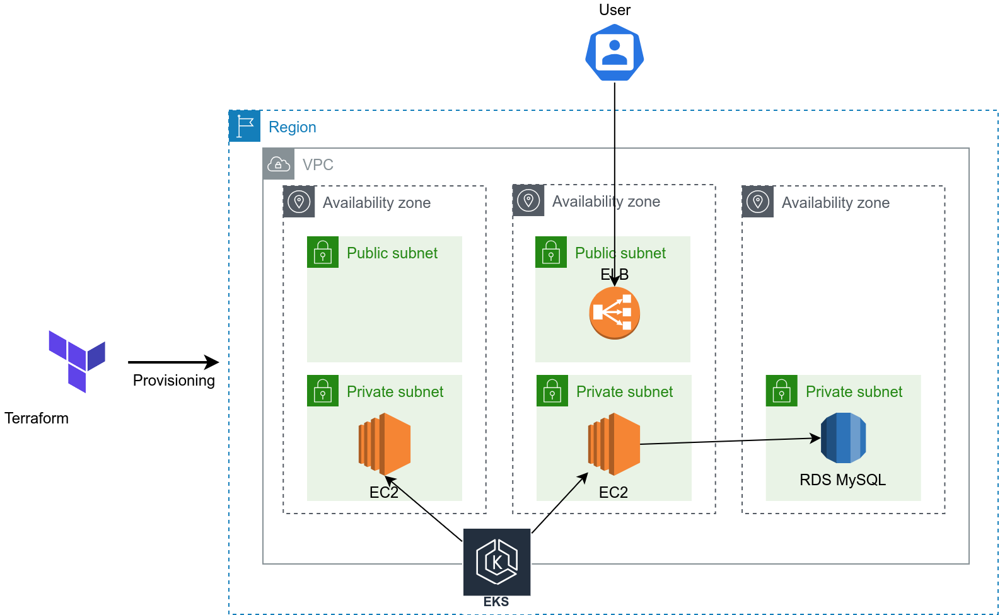
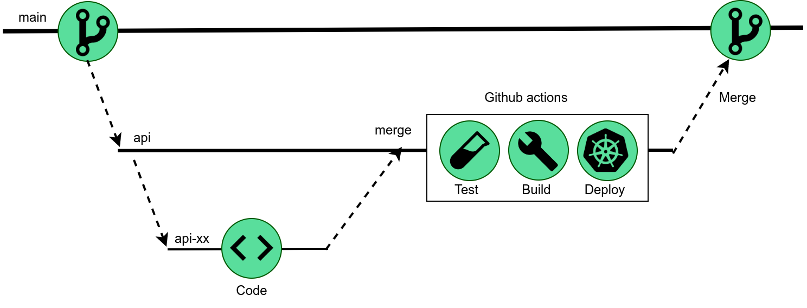

# Desafio DevOps Ada

Este repositório contém o código para o provisionamento da infraestrutura e criação de
serviços na AWS, assim como o código das aplicações.

O provisionamento da infraestrutura na AWS é feita usando o Terraform. O terraform
é responsável por criar um cluster EKS, adicionar um grupo de nós (instâncias EC2),
configurar a infraestrutura de redes, subir o banco de dados no RDS e criar DNS para as
aplicações.




### Estrutura do repositório

```
 .  ├── .github
        |── workflows                 # Diretório com arquivos das pipelines do GitHub Actions
            |── backend.yaml          # Pipeline da aplicação Backend
            |── deploy.yaml           # Pipeline de deploy no EKS
            |── frontend.yaml         # Pipeline da aplicação Frontend
    ├── apps
        |── backeend
            |── app                   # Diretório de código da aplicação backend
            |── backend-manifest.yaml # Arquivo manifesto do kubernetes da aplicação backend
            |── Dockerfile            # Arquivo de Dockerfile da aplicação API
        |── frontend
            |── app                   # Diretório de código da aplicação frontend
            |── frontend-manifest.yaml# Arquivo manifesto do kubernetes da aplicação frontend
            |── Dockerfile            # Arquivo de Dockerfile da aplicação frontend
    ├── doc                           # Diretório com arquivos relacionados à documentação
        |── ...
    ├── iac                           # Diretório que contem código para provisionamento da infraestrutura
        |── eks                       # Terraform para provisionar o EKS
        |── net                       # Terraform para provisionar e configurar a VPC
        |── rds                       # Terraform para provisionar o RDS
        |── route53                   # Terraform para provisionar o Route53
        |── deoploy-apps-eks.sh       # Script para subir nginx no EKS
    └── ...

```

### Requisitos

Desnvolvimento:
- git
- docker

Provisionamento da Infraestrutura:
- aws-cli
- Terraform

## Provisionamento da infraestrutura

O provisionamento da infraestrutura na AWS é realizado pelo Terraform.
Antes de tudo, é preciso adicionar as credenciais do usuário IAM
da AWS na máquina que vai executar o Terraform. A documentação de como configurar
a conta IAM usando o AWS cli pode ser encontrada [clicando aqui](https://docs.aws.amazon.com/cli/latest/userguide/cli-chap-configure.html).
O estado do Terraform (tfstate) é armazenado em um bucket S3, portanto, se ele não tiver configurado,
é preciso criar o bucket e adicionar as referências dele no bloco backend do [main.tf](iac/eks/main.tf)

O primeiro passo é subir as configurações de rede com o terraform. 

No diretório [net](./iac/net):

```bash
terraform init
terraform apply
```
Aguarde a finalização do provisionamento e va para o passo seguinte.

Para provisionar o EKS, primeiro execute o init, depois execute o terraform apply, passando o identificador da conta AWS que terá permissões no EKS.

No diretório [eks](./iac/eks):

```bash
terraform apply -var="aws_account_id=<id>"
```

Aguarde o provisionamento, que leva em torno de 15 minutos. Após
receber a mensagem de "Apply complete!", você pode usar o aws-cli para
obter o kubeconfig e visualizar o cluster:

```bash
aws eks update-kubeconfig --name eks-apps --output yaml
```

Para provisionar o RDS, no diretório [rds](./iac/rds), execute:

```bash
terraform init
terraform apply -var="rds_password=<some-initial-password>"
```

Passando a variável rds_password, que é uma senha inicial para o banco de dados.

Aplique as aletrações:

É necessário subir o nginx ingress controller no cluster, para isso,
execute o script [deploy-apps-eks](./iac/deploy-apps-eks.sh):

```bash
./deploy-apps-eks.sh
```

Por último, para configurar o DNS para o LoadBalancer, é preciso executar
o Terraform no diretório [route53](./iac/route53). Como pré-requsito, é nesessário pré-criar uma
Zona hospedada.


As seguintes variáveis precisam ser passadas para o terraform:

record_name: nome do DNS a ser criado

zone_id_route: ID da zona do Route53 a ser criado o DNS

elb_name: Nome do Elastic Load Balancer

zone_id_elb: ID do Load balancer

```bash
terraform apply -var="record_name=<record_name>" -var="zone_id_route=<zone_id_route>"  \
-var="elb_name=<elb_name>" -var="zone_id_elb=<zone_id_elb>"
```


## Configuração do fluxo de CI/CD

O GitHub executa automaticamente as pipelines nas branches especificadas no código.
Entretanto, é preciso adicionar algumas variáveis de ambiente no GitHub para
que a pipeline consiga fazer o deploy na AWS.

As seguintes secrets precisam estar configuradas no repositório do GitHub:

AWS_ACCESS_KEY_ID -> Identificador da conta IAM

AWS_SECRET_ACCESS_KEY -> Secret da conta IAM

AWS_REGION -> Região onde se encontra o cluster na AWS

As variáveis AWS_ACCESS_KEY_ID e AWS_SECRET_ACCESS_KEY podem ser obtidas através da criação de um usuário IAM  na AWS.
Esse usuário precisa ter permissão de acesso ao cluster Kubernetes criado.


## Fluxo de desenvolvimento

O fluxo de CI/CD da aplicação Backend ocorre na branch "api" e o da aplicação
Frontend ocorre na branch "frontend". Logo, todo merge nestas branches aciona
uma pipeline no GitHub Actions.

O Desenvolvedor deve criar uma nova branch a partir da branch principal da aplicação que ele deseja trabalhar. Por exemplo,
se tiver trabalhando com o Backend, deve criar uma branch apartir da "api".

Ao finalizar as alterações, o desenvolvedor dever fazer um merge na branch principal, essa que vai acionar
um fluxo no GitHub Actions. No fluxo é feito um build da aplicação gerando uma imagem e subindo ela para o Elastic Container Service (ECS).
Após a geração da imagem, é realizado o deploy da aplicação no Elastic Kubernetes Service (EKS).



## Futuras melhoras

- Automatização da criação de bucket no s3 para armazenar o tfstate do Terraform
- Adicionar um password rotate para o RDS
- Adicionar uma pipeline no GitHub Actions para fazer deploy da infraestrutura
- Automatização da criação de uma Zona Hospedada no Route 53
- Configurar uma estera para subir aplicações de infra no Kubernetes e.g. nginx
- Adicionar etapa de aprovação do Merge Request nas branches de aplicação no Github Actions
- Adicionar etapa de testes das aplicações nas pipelines do Github Actions